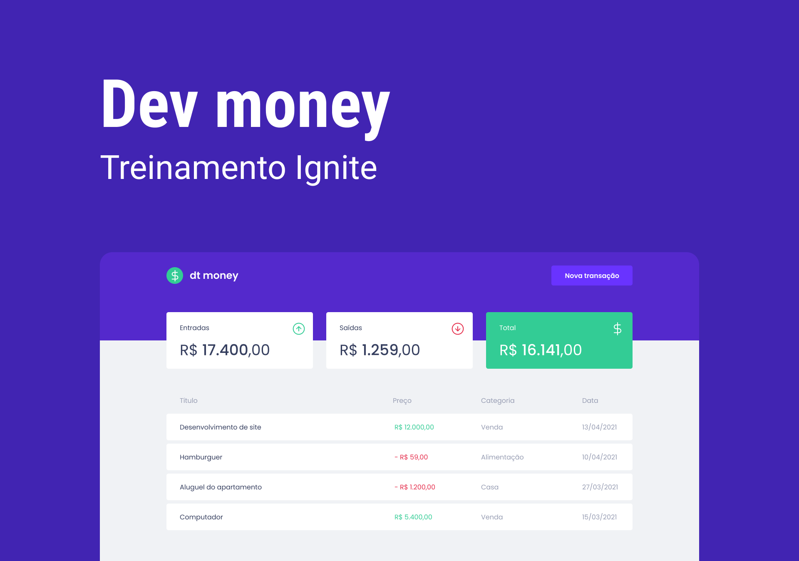

## Dev money

Simple React application for personal finances control.



### Setup

Have `yarn` and `node` installed

### Running

```bash
# run on port 3000
$ yarn start
```

### Technologies

- React
- TypeScript
- Styled Components

### 📝 MIT License

This project is licensed under the MIT License - see the [LICENSE](LICENSE) file for details.

### Credits

Made during the Ignite Program by [RocketSeat](https://rocketseat.com.br/) 🚀
